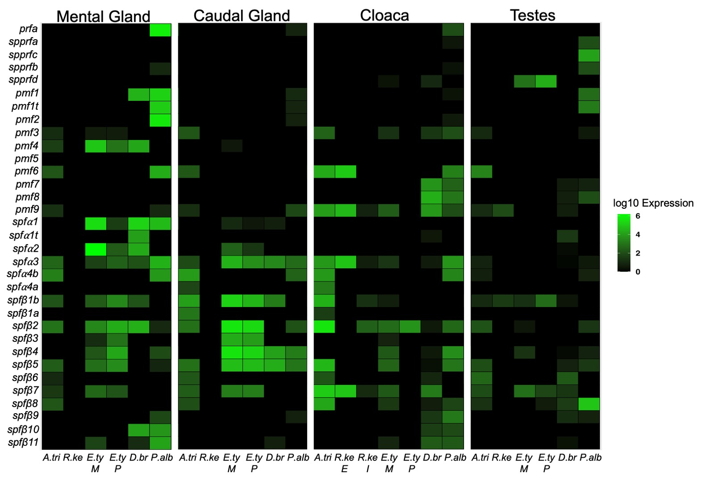

## What is a Heatmap?
Heatmaps are a data visualization method that transform data to a color scale. This allows us to easily view the magnitude of differences in the data betwen groups based on changes in colors or color intensity. Heatmaps can be used to visualize a wide variety of numerical data types. In biology, we often see them used to visualize gene expression data, which is how I utilize heatmaps and is the type of data we will be working with today.

### Heatmap Example


## How do we make a Heatmap in R?
There are actually quite a few programs/functions that can be used to make a heatmap in R. These include:

- heatmap(): part of the *stats* package
- heatmap.2(): part of the *gplots* package
- geom_tile(): part of the *ggplot2* package
- pheatmap(): part of the *pheatmap* package
- Heatmap(): part of the *ComplexHeatmap* package from bioconductor

You can also make interactive heatmaps, which are cool but don't have a ton of utility for making publication ready figures. We won't discuss these but if you're interested here are some functions you can investigate:

- plot_ly(): part of the *plotly* package
- d3heatmap(): part of the *d3heatmap* package
- heatmaply(): part of the *heatmaply* package

For the purposes of this lesson we will use two different functions to create heatmaps:

1. heatmap()
2. geom_tile()

## Well, let's make some heatmaps!

Make sure all the packages are loaded:
```{r}
library(stats)
library(ggplot2)
```

Okay, to make these heatmaps we will be using some pheromone gene expression data I generated. For some context, these pheromones are produced by courtship glands that male salamanders possess. In this data set we are looking at the expression of eleven different pheromone genes across four different salamanders and between two gland types (mental gland-mg and caudal gland-cg). These data have already been normalized and log transformed. 

[Pheromone Data](pheromone_data.csv)

### Using the built in heatmap() function

Let's load in the data
```{r}
pheromone_data <- read.csv("pheromone_data.csv")
#in order to use the heatmap() function, we need to transform the csv file into a numeric data frame
#this also allows us to make sure we keep our rownames
pheromone_data1 <- as.matrix(pheromone_data[,-1])
rownames(pheromone_data1) <- pheromone_data[,1]
```

So what does the heatmap look like if we use the default functions?
```{r}
heatmap(pheromone_data1)
```

This heatmap stinks. Let's make it better.
```{r}
heatmap(pheromone_data1, 
        Colv = NA, #get rid of column clustering
        Rowv = NA, #get rid of row clustering
        margins = c(7,5), #change the margins so we can fit in the column names with the axis title
        cexCol = 1, #change the size of the column names
        main = "Pheromone Gene Expression", #add a title
        xlab = "Groups", #add an x axis label
        ylab = "Gene") #add a y axis label
```

We can also change the color palette but I do not find this very intuitive with this function. 
```{r}
heatmap(pheromone_data1, 
        Colv = NA, #get rid of column clustering
        Rowv = NA, #get rid of row clustering
        margins = c(7,5), #change the margins so we can fit in the column names with the axis title
        cexCol = 1, #change the size of the column names
        col = terrain.colors(10), #changing the color palette and selecting how many colors to use
        main = "Pheromone Gene Expression", #add a title
        xlab = "Groups", #add an x axis label
        ylab = "Gene") #add a y axis label
```

So, we have made a heatmap with the base function. It work's but we can't customize a lot, there is no legend, and I find it hard to change the colors... among a variety of other issues with customization. So, let's make a heatmap with ggplot2!!!!

### Using ggplot2 to create heatmaps

Alright, to make a heatmap in ggplot2 our data needs to be in "long" format. We could use tidyverse to manipulate the last data file but to save time I have already changed the csv file.

[Pheromone Data2](pheromone_data2.csv)

Alright, let's load in our data.
```{r}
pheromone_data2 <- read.csv("pheromone_data2.csv")
```

Okay, let's start off by making a basic heatmap with geom_tile
```{r}
ggplot(pheromone_data2, #give it the data
       aes(x = Sample, y = Gene, fill = Expression)) + #set our x and y and what data we want to "fill" our heatmap with
         geom_tile() #the heatmap plot function
```

Okay, not too bad. However, we can customize a lot of things. Let's start by changing the plot color and getting rid of the background items.
```{r}
ggplot(pheromone_data2, aes(x = Sample, y = Gene, fill = Expression)) +
  geom_tile(colour="black", linewidth=0.5)+ #here we are adding outlines around our tiles
  #we can change the colour and thickness of this outline
  scale_fill_gradient(low = "black", high = "green")+ #change the color gradient
  theme_grey(base_size=12)+ #change our theme and make our base size font 12
  theme(axis.ticks = element_blank(), #get rid of the tick marks
        #get rid of all the background ggplot2 aesthetics
        plot.background = element_blank(), 
        panel.background = element_blank(),
        panel.border = element_blank())
```

Looking better, now let's focus on our axis titles/labels, our legend, and our plot title.
```{r}
ggplot(pheromone_data2, aes(x = Sample, y = Gene, fill = Expression)) +
  geom_tile(colour="black", linewidth=0.5)+ 
  scale_fill_gradient(low = "black", high = "green")+
  theme_grey(base_size=12)+
  ggtitle(label = "Pheromone Gene Expression") + #add a plot title
  theme(plot.title = element_text(face="bold"), #make the plot title bold
        legend.title = element_text(face = "bold"), #make the legend title bold
        axis.title = element_text(face="bold"), #make the axis titles bold
        axis.text.y =element_text(color = "black"), #make the axis labels black instead of grey
        axis.text.x =element_text(angle = 270, hjust = 0, color = "black"), #change the angle of the axis labels,
        #the position, and the color
        axis.ticks= element_blank(),
        plot.background=element_blank(),
        panel.background = element_blank(),
        panel.border = element_blank())
```

So, even changing the angle of the x axis labels doesn't make it look great. We can use facet combined with the function scale_x_discrete. 
```{r}
ggplot(pheromone_data2, aes(x = Sample, y = Gene, fill = Expression)) +
  geom_tile(colour="black", linewidth=0.5)+ 
  scale_fill_gradient(low = "black", high = "green")+
  theme_grey(base_size=12)+
  facet_grid(~ Gland) + #here we are faceting by gland
  ggtitle(label = "Pheromone Gene Expression") +
  scale_x_discrete(labels=c('D.brim', 'E.tyn M', 'E.tyn P', 'P.alb', 'D.brim', 'E.tyn M', 'E.tyn P', 'P.alb'))+ #here we are changing the x axis labels
  theme(plot.title = element_text(face="bold"),
        legend.title = element_text(face = "bold"),
        axis.title = element_text(face="bold"),
        axis.title.x = element_blank(),
        axis.text.y =element_text(color = "black"),
        axis.text.x =element_text(color = "black"),
        axis.ticks=element_blank(),
        plot.background=element_blank(),
        panel.background = element_blank(),
        panel.border = element_blank())
```

Alright, so we only want to display the columns for which we have data for in our facet. We can also change the aesthetics of our facet label
```{r}
ggplot(pheromone_data2, aes(x = Sample, y = Gene, fill = Expression)) +
  geom_tile(colour="black", linewidth=0.5)+ 
  scale_fill_gradient(low = "black", high = "green")+
  theme_grey(base_size=12)+
  facet_grid(~ Gland, switch = "x", scales = "free_x", space = "free_x") + #switch moves the facet labels to the bottom
  #applying "free_x" removes the columns for which there is no data and
  #applying "free_x" to space makes the columns the same width
  ggtitle(label = "Pheromone Gene Expression") +
  scale_x_discrete(labels=c('D.brim', 'E.tyn M', 'E.tyn P', 'P.alb', 'D.brim', 'E.tyn M', 'E.tyn P', 'P.alb'))+
  theme(plot.title = element_text(face="bold"),
        strip.placement = "outside", #this places the facet label outside the x axis labels
        strip.text = element_text(face = "bold"), #this bolds the text in the facet label
        legend.title = element_text(face = "bold"),
        axis.title = element_text(face="bold"),
        axis.title.x = element_blank(),
        axis.text.y =element_text(color = "black"),
        axis.text.x =element_text(color = "black"),
        axis.ticks=element_blank(),
        plot.background=element_blank(),
        panel.background = element_blank(),
        panel.border = element_blank())
```

Woohoo!!!! Now we have a very nice looking heatmap. I will say I usually end up changing the aesthetics of the axis labels/titles in other programs such as Inkscape and there are still many aesthetic customization edits would could make with ggplot2 outside of what we did today. For example, with the facet labels you can change the background (strip.background()) and border colors. You can also change how the key looks. There seem to be endless customization edits you can make but we will stop here for now.

## Assignment 
Take the following dataset and create a heatmap using ggplot2 that is faceted by tissue type. Customize the heatmap and make sure all the axis labels/titles are correct and that you can read them all. Make sure to add a plot title. Feel free to customize the color and whatever else you see fit. Create an R Markdown file with a link to your script as well as an imbedded image of your heatmap. 

[Assignment Data](MAH_assignment_data.csv)

[One possible solution](assignment_script.R)


